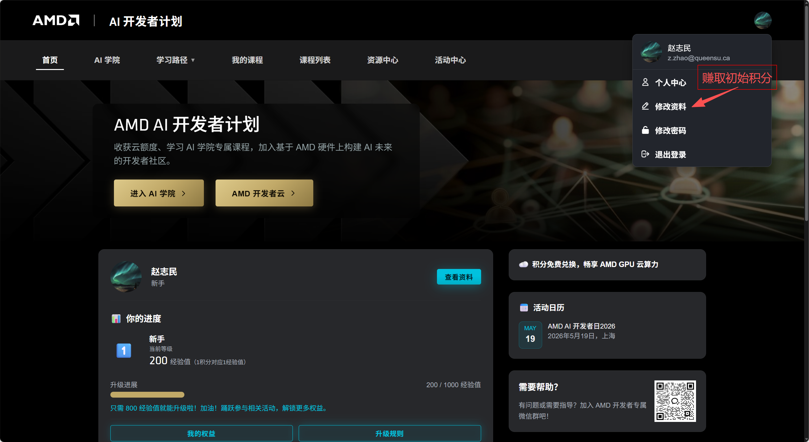
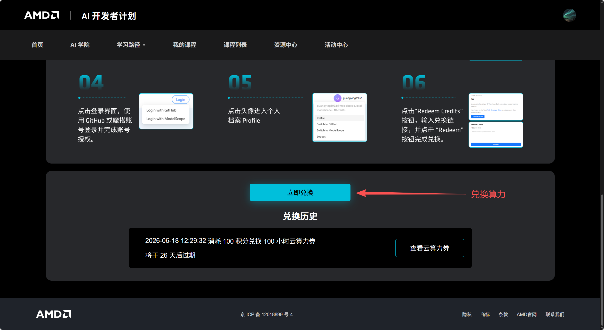
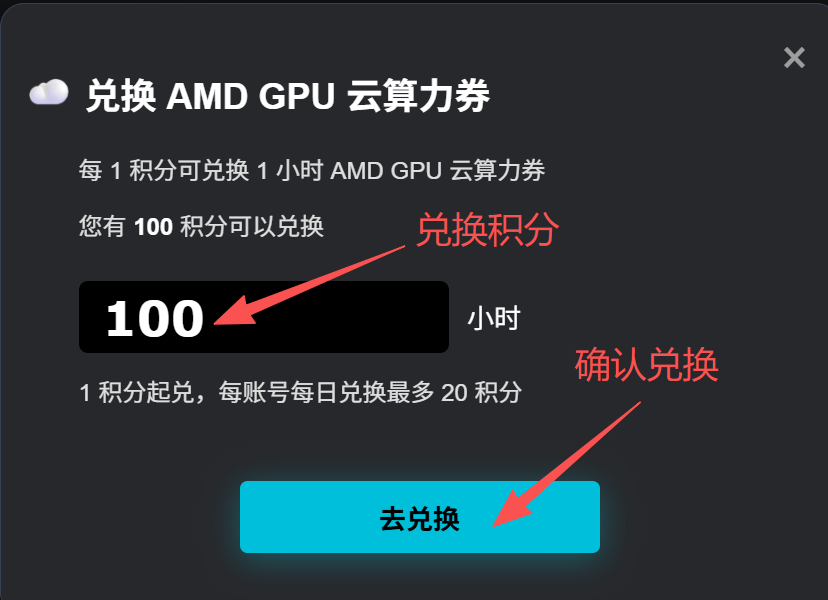
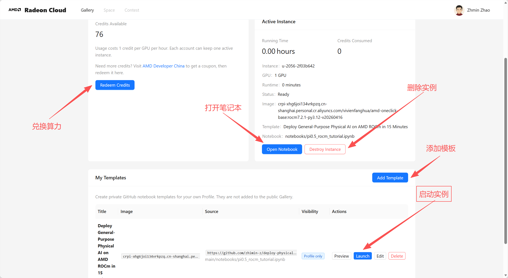
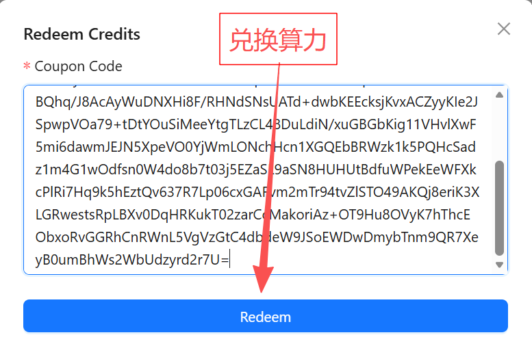
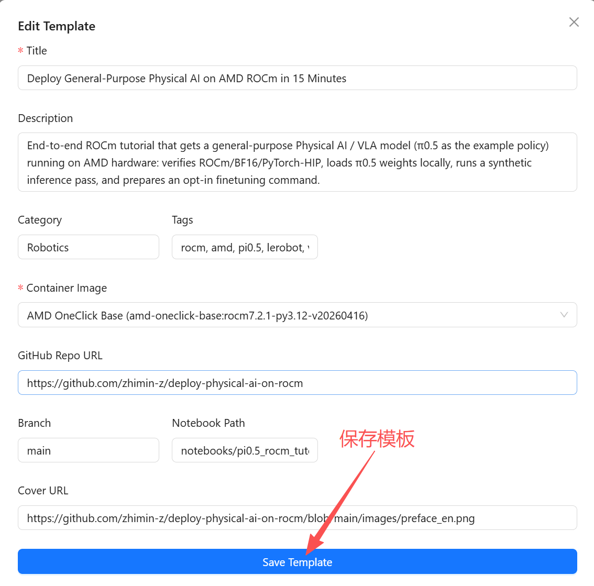

# 在哪里以及如何运行本教程

## 方式一：使用你自己的 AMD GPU 硬件（推荐，如果你有的话）

如果你本地已经有一块受 ROCm 支持的 AMD GPU，**完全可以直接在自己的机器上运行本教程**，无需申请云算力。

**硬件要求：** 推荐使用 **RDNA3 级别（gfx1100，例如 Radeon RX 7900 XTX / 7900 XT / W7900）或更新** 的 AMD GPU，并搭配 ROCm 7.x。更早的架构可能可以工作，但本教程是在 gfx1100 上验证的，不保证在更老的卡上获得相同结果。

满足条件后，你只需在本地准备好 ROCm 7.x + PyTorch 环境，克隆本仓库，直接打开并运行 [`notebooks/pi0.5_rocm_tutorial.ipynb`](notebooks/pi0.5_rocm_tutorial.ipynb) 即可，可以跳过下面的云端步骤。

## 方式二：使用 AMD GPU 云实例（没有本地硬件时）

如果你没有满足要求的 AMD GPU，本教程也设计为可在通过 AMD AI Developer Program 和 Radeon Cloud 提供的 **AMD GPU 云实例** 上运行。请按照下面的步骤获取免费算力并启动 notebook。

## 1. 注册 AMD Developer 账号

前往 <https://developer.amd.com.cn/login> 注册一个 AMD 账号。

## 2. 完善个人资料以获得 200 经验值

在 <https://developer.amd.com.cn/editProfile> 填写**全部**个人资料字段。
完善资料后可获得 **200 经验值（experience points）** 作为起始积分。

## 3. 将积分兑换为算力（compute hours）

获得起始积分后，前往 <https://developer.amd.com.cn/points/redeem>，
将积分兑换为 AMD Cloud 上等值的算力（compute hours）。

> **注意：** 每份兑换的算力（compute hour）将在 **30 天** 后过期。

## 4. 复制兑换码（coupon code）并登录 Radeon Cloud

兑换完成后，**复制兑换码（coupon code）**，然后登录 <https://radeon.anruicloud.com>。

进入个人主页 <https://radeon.anruicloud.com/profile>，点击 **Redeem** 按钮。

将兑换码粘贴到对话框中，然后点击 **Redeem**。

## 5. 添加教程模板（Template）

在同一个个人主页上，点击 **Add Template** 按钮，并按如下内容填写各字段：

| 字段 | 值 |
| --- | --- |
| **Title** | Deploy General-Purpose Physical AI on AMD ROCm in 15 Minutes |
| **Description** | End-to-end ROCm tutorial that gets a general-purpose Physical AI / VLA model (π0.5 as the example policy) running on AMD hardware: verifies ROCm/BF16/PyTorch-HIP, loads π0.5 weights locally, runs a synthetic inference pass, and prepares an opt-in finetuning command. |
| **Category** | Robotics |
| **Tags** | rocm, amd, pi0.5, lerobot, vla, physical-ai, pytorch, bf16, inference, finetuning, gfx1100 |
| **Container Image** | AMD OneClick Base (amd-oneclick-base:rocm7.2.1-py3.12-v20260416) |
| **GitHub Repo URL** | https://github.com/zhimin-z/deploy-physical-ai-on-rocm |
| **Branch** | main |
| **Notebook Path** | notebooks/pi0.5_rocm_tutorial.ipynb |
| **Cover URL** | https://github.com/zhimin-z/deploy-physical-ai-on-rocm/blob/main/images/preface.png |

## 6. 保存并启动模板（Template）

保存模板，然后在同一个个人主页上 **Launch** 它。稍等片刻，你将被
自动重定向到云镜像实例（cloud image instance），在那里你可以像平常一样运行
Jupyter notebook。

> **⚠️ 注意你的算力（compute hours）：** 正在运行的实例会持续消耗你兑换的算力，
> 直到你从个人主页 **删除该实例（delete the instance）**。工作完成后请务必销毁
> 实例，以免耗尽你的算力。

享受配置过程吧 —— 然后回到 [README](README.md)，在实例中进行 Physical AI
模型部署。🙂
